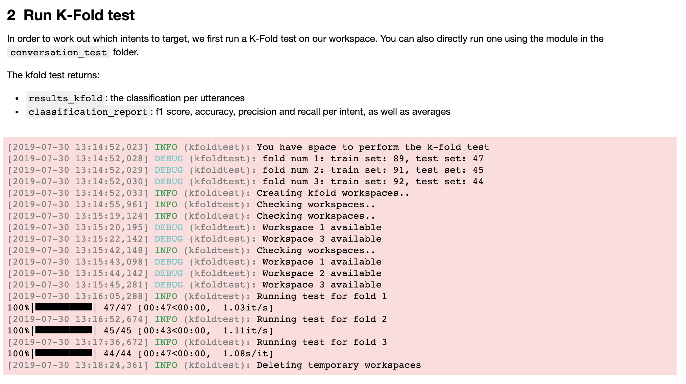
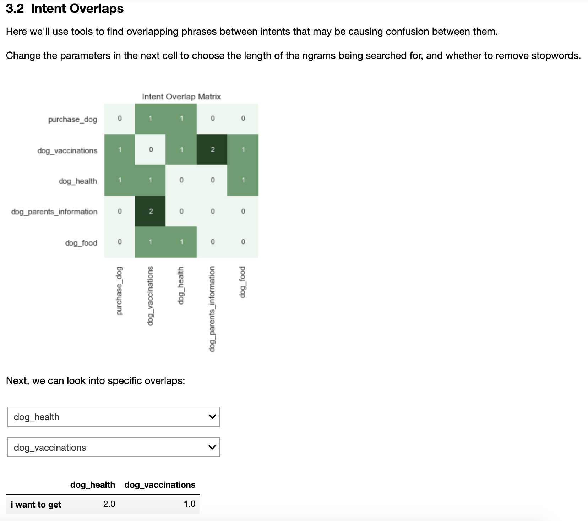

# Intent Training Tools

## Contents
- [Description](#description)
- [Quickstart](#quickstart)
  - [*I'm reading the Training at Scale paper*](#im-reading-the-training-at-scale-paper)
  - [*I just want to use the test suite*](#i-just-want-to-use-the-test-suite)
- [Further Usage](#further-usage)

## Description
A series of tools to support training and testing of intents within Watson Assistant instances. It's split into notebooks, command line tools, and a small test suite. These are best used alongside the Training at Scale paper (*link soon*).

    
    

## Quickstart 

Before you do anything else, you'll need to make `config.py` and `Credentials.py` files. We've provided sample ones for you to get started.

### *I'm reading the Training at Scale paper*
The easiest way to get this up and running is to use the two notebooks, which connect to your Watson Assistant instance: 
- `exploratory_analysis`: for conducting exploratory analysis of intent data  
- `targeted_training`: guides you through the targeted training process detailed in the Training at Scale paper.

All the notebooks are (roughly) self documenting, and you can find more details on what's in them in the paper.

### *I just want to use the test suite*
Cool. We have a small test suite that does blindset tests and K-Fold tests. First set yourself up with the `config.py` and `Credentials.py` files. Then, everything you need is in the `conversation_test` folder, and you can basically ignore everything else in here.

2 steps (after config & credentials):
1. Install dependencies (you'll need to be in the root of the repo for this). `pip install -r requirements.txt`
2. You're now good to go, pending some data if you want to run a blindset test. Follow [instructions in the wiki](https://github.ibm.com/Kalyan-Dutia/intent_training_tools/wiki/Test-Suite) to get set up.

## Further Usage
As well as the notebooks and test suite there are also some CLI tools, with which you can do everything in the notebooks and a bit more. More details on these [in the Wiki](https://github.ibm.com/Kalyan-Dutia/intent_training_tools/wiki/Command-Line-tools).

## Author/Contact
Kalyan Dutia (kalyan.dutia@ibm.com)

Please slack me in the first instance *@kalyan*, or raise an issue on the repo if it's not too urgent. 
